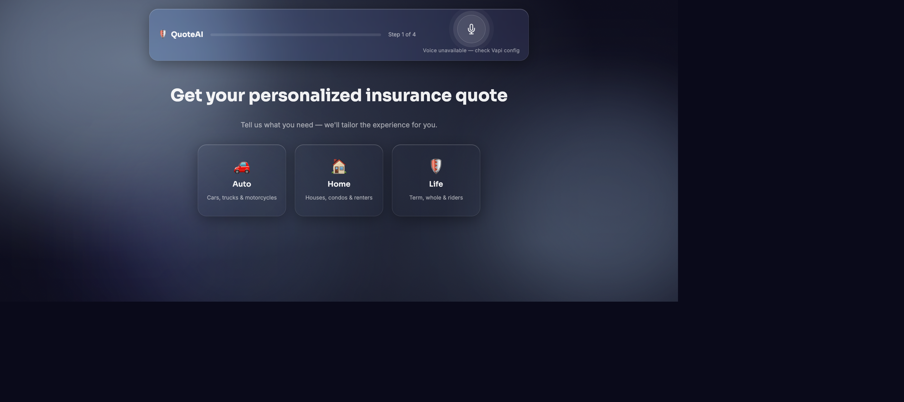
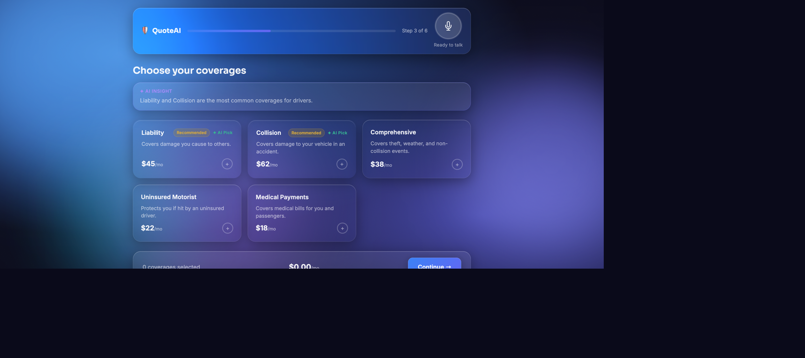
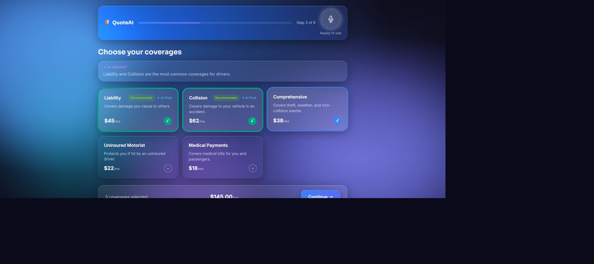
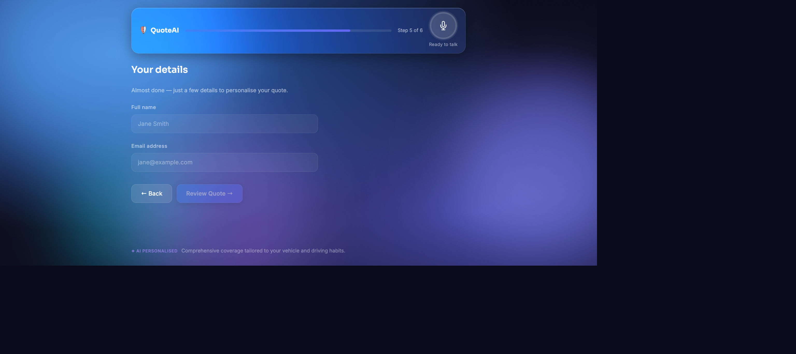
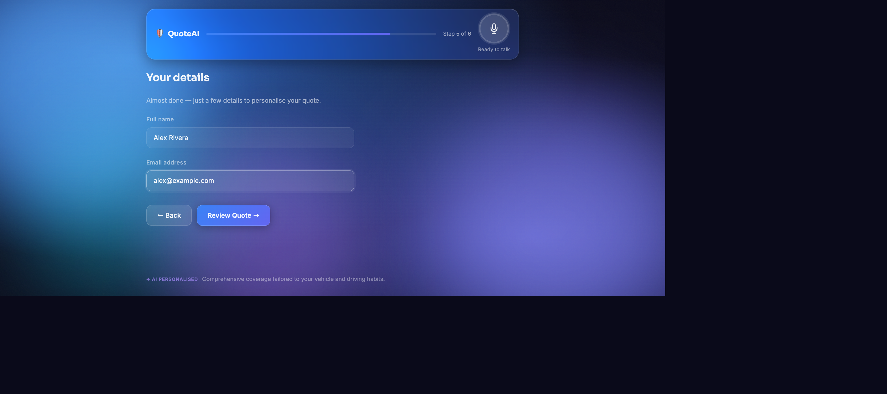
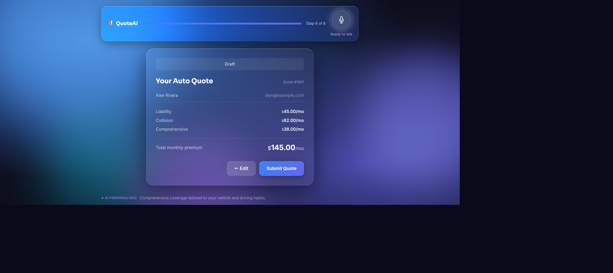
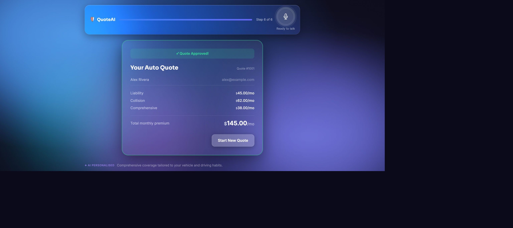

# QuoteAI — Voice-Powered Insurance Quote Builder

> An AI-native insurance quoting experience built with Angular 21, GraphQL, Vapi voice AI, and Claude GenUI — featuring a liquid-glass UI that adapts in real time based on who's asking.

[](https://voice-quote.netlify.app)
[](https://quote-builder-backend.fly.dev/graphql)
[](https://github.com/DevArtsLab/voice-quote)

---

## Screenshots

### Step 1 — Choose your line of business


---

### Step 2 — AI-powered coverage selection
Claude generates a personalised UI spec in real time: recommended coverages are badged, the theme shifts to match the product, and an AI Insight banner surfaces contextual advice.



---

### Step 3 — Coverages selected with live total
Selecting coverages updates the running monthly premium instantly. AI-picked options are highlighted.



---

### Step 4 — Applicant details
Clean glass-morphism form. The "Review Quote" button stays disabled until both fields pass validation.





---

### Step 5 — Quote summary (Draft)
A `createQuote` GraphQL mutation fires on load. The card shows all selected coverages, applicant info, and total premium.



---

### Step 6 — Real-time approval via GraphQL Subscription
Clicking Submit fires `submitQuote`. A WebSocket subscription delivers the live status update — the card turns green with "✓ Quote Approved!" within ~1.5 seconds.



---

## Features

- **🎙️ Voice-first UX** — Vapi voice AI guides users through the entire quote flow hands-free, filling form fields and navigating steps via tool calls
- **🤖 GenUI (Generative UI)** — Claude Anthropic generates a personalised UI spec per user: custom themes, AI-recommended coverages, contextual copy
- **💎 Liquid Glass design system** — CSS variable–driven glass-morphism with per-LOB colour palettes, animations, and micro-interactions
- **⚡ Real-time subscriptions** — GraphQL WebSocket subscriptions deliver live quote status updates
- **📡 Server-Sent Events** — Vapi tool calls are broadcast from the backend to the Angular frontend via SSE
- **🔒 Secrets never in source** — API keys live in `.env` on the backend and are served to the browser only via `/api/config` at runtime

---

## Tech Stack

| Layer | Technology |
|---|---|
| **Frontend** | Angular 21 · Standalone components · Signals · TailwindCSS v4 |
| **GraphQL client** | Apollo Angular v14 · HTTP + WebSocket split link |
| **Backend** | Node.js · Express 4 · Apollo Server v4 |
| **GraphQL server** | Schema-first SDL · graphql-ws subscriptions · PubSub |
| **AI — GenUI** | Anthropic Claude (claude-opus-4-5) via REST |
| **AI — Voice** | Vapi Web SDK · SSE tool-call bridge |
| **Deployment** | Netlify (frontend) · Fly.io (backend) |

---

## Architecture

```
┌─────────────────────────────────────────┐
│          Angular SPA (Netlify)          │
│                                         │
│  ┌──────────┐  ┌──────────────────────┐ │
│  │  Quote   │  │  VoiceMicButton      │ │
│  │  Wizard  │  │  (Vapi Web SDK)      │ │
│  │  Steps   │  └──────────┬───────────┘ │
│  └────┬─────┘             │             │
│       │ Apollo            │ SSE events  │
│       │ GraphQL           │             │
└───────┼───────────────────┼─────────────┘
        │                   │
        ▼                   ▼
┌─────────────────────────────────────────┐
│         Express Backend (Fly.io)        │
│                                         │
│  /graphql   ── Apollo Server v4         │
│  /api/generate-ui ── Claude (GenUI)     │
│  /api/vapi-webhook ── Tool call handler │
│  /api/events  ── SSE broadcast          │
│  /api/config  ── Public key delivery    │
└─────────────────────────────────────────┘
        │
        ▼
┌──────────────────┐   ┌───────────────┐
│  Anthropic API   │   │   Vapi API    │
│  (GenUI specs)   │   │  (Voice AI)   │
└──────────────────┘   └───────────────┘
```

---

## Local Development

### Prerequisites
- Node.js 20+
- Angular CLI 21: `npm i -g @angular/cli`
- Fly CLI (optional, for backend deploy): `brew install flyctl`

### 1. Clone
```bash
git clone https://github.com/DevArtsLab/voice-quote.git
cd voice-quote
```

### 2. Backend
```bash
cd backend
cp .env.example .env   # add your keys
npm install
node src/index.js
# GraphQL: http://localhost:4000/graphql
```

**Required env vars** (in `backend/.env`):
```env
ANTHROPIC_API_KEY=sk-ant-...
VAPI_API_KEY=your-vapi-public-key
VAPI_ASSISTANT_ID=your-assistant-id
FRONTEND_URL=http://localhost:4200
PORT=4000
```

### 3. Frontend
```bash
cd frontend
npm install
npm start
# App: http://localhost:4200
```

---

## Deployment

### Frontend → Netlify
Connect `DevArtsLab/voice-quote` on [netlify.com](https://netlify.com). The `netlify.toml` at repo root handles everything — base directory, build command, SPA redirects, and `API_BASE_URL` injection.

### Backend → Fly.io
```bash
cd backend
fly auth login
fly launch --name quote-builder-backend --no-deploy
fly secrets set \
  ANTHROPIC_API_KEY="sk-ant-..." \
  VAPI_API_KEY="your-key" \
  VAPI_ASSISTANT_ID="your-assistant-id" \
  FRONTEND_URL="https://voice-quote.netlify.app"
fly deploy
```

---

## GraphQL API

**Queries**
```graphql
query {
  coverageOptions(lineOfBusiness: auto) {
    id name monthlyPremium recommended
  }
}
```

**Mutations**
```graphql
mutation CreateQuote($input: QuoteInput!) {
  createQuote(input: $input) { id status totalMonthlyPremium }
}
mutation SubmitQuote($id: ID!) {
  submitQuote(id: $id) { id status }
}
```

**Subscriptions**
```graphql
subscription OnStatusUpdate($id: ID!) {
  quoteStatusUpdated(id: $id) { id status }
}
```

---

## Vapi Voice Flow

The voice assistant guides users through the wizard by calling backend tools:

| Tool | What it does |
|---|---|
| `fill_form_field` | Sets a form field value (LOB, name, email) |
| `highlight_coverage` | Visually highlights a coverage card |
| `advance_step` | Navigates the wizard to the next step |
| `submit_quote` | Triggers the GraphQL quote submission |

Tool calls flow: **Vapi → POST `/api/vapi-webhook` → SSE → Angular `VapiService`**

Get the full tool definitions:
```bash
curl https://quote-builder-backend.fly.dev/api/vapi-tools
```

---

## Project Structure

```
quote-builder/
├── backend/
│   ├── src/
│   │   ├── index.js          # Express + Apollo Server
│   │   ├── schema.graphql    # SDL schema
│   │   ├── resolvers.js      # Query / Mutation / Subscription
│   │   ├── genui.js          # Claude GenUI spec generator
│   │   ├── vapi-tools.js     # Vapi tool definitions + SSE broadcast
│   │   └── data.js           # In-memory seed data
│   └── fly.toml
├── frontend/
│   ├── src/app/
│   │   ├── quote-wizard/     # Wizard shell + step components
│   │   ├── services/         # VapiService, GenUIService, QuoteStoreService
│   │   ├── components/       # VoiceMicButton, AnimatedBackground
│   │   └── graphql/          # Apollo queries, mutations, subscriptions
│   └── src/environments/     # Dev + prod environment files
├── docs/screenshots/         # README screenshots
└── netlify.toml
```

---

## License

MIT © [DevArtsLab](https://github.com/DevArtsLab)
